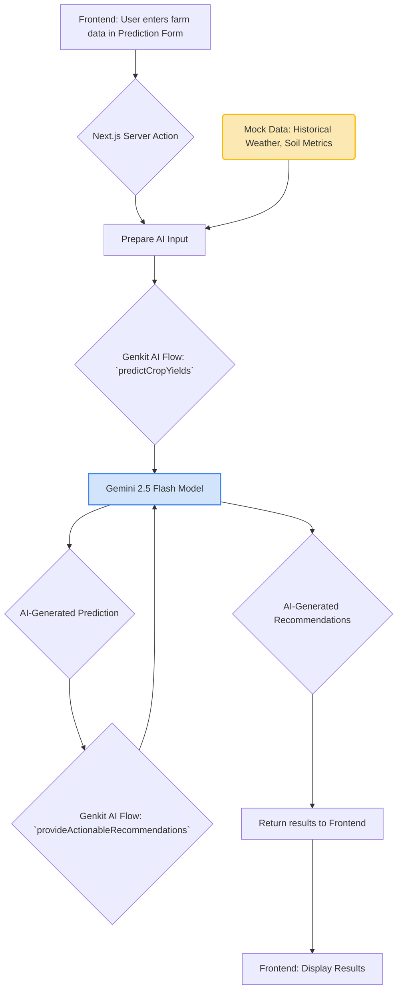
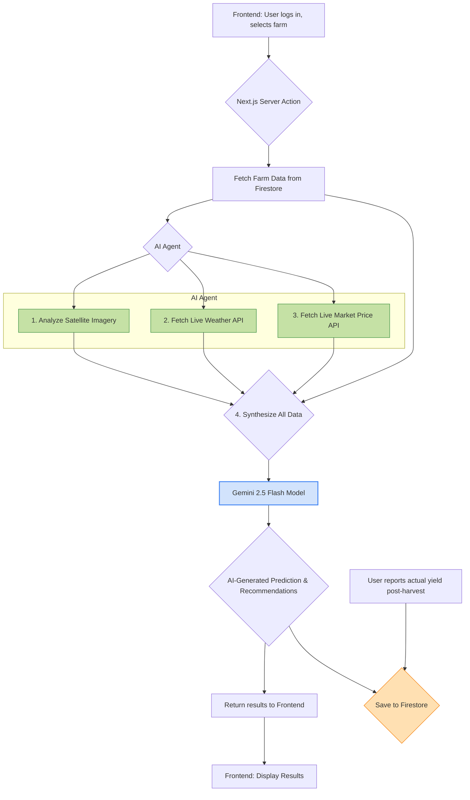

# System Architecture

This document outlines the current system architecture of the IndiYield application and presents a vision for its future, production-ready state.

## Present Architecture (Hybrid AI Model)

Our current system is a modern, serverless web application that intelligently uses a real-time Generative AI model for its core features, supplemented by simulated data for prototyping purposes.

### Core Components:

1.  **Frontend:**
    *   **Framework:** Next.js 14+ (using the App Router).
    *   **UI Components:** Built with the reusable and accessible **shadcn/ui** component library.
    *   **Styling:** Styled with **Tailwind CSS** for a modern, responsive, and utility-first design approach.
    *   **Hosting:** Designed to be deployed on **Firebase App Hosting**, providing a scalable, secure, and serverless environment.

2.  **Backend & AI Core (The "Brain"):**
    *   **AI Framework:** We use **Genkit**, Google's open-source framework for building production-ready generative AI applications. It orchestrates the entire AI process, from defining prompts to calling models.
    *   **AI Model:** All core reasoning, prediction, and recommendation tasks are performed by the **Google Gemini 2.5 Flash model in real-time**. This is not dummy logic; it's a powerful Large Language Model that generates unique outputs for every request.
    *   **Backend Logic:** Communication between the frontend and the AI is handled by **Next.js Server Actions** (`src/app/actions.ts`). This is a secure and efficient RPC-style communication layer.

### Data Flow (How It Works Now):

The current architecture uses a **hybrid approach** where the AI model's reasoning is real, but some of the supplementary data it reasons upon is simulated for this prototype.

1.  The user provides their specific farm details (land type, crop choice, location) via the UI.
2.  The Server Action takes this data and combines it with **simulated data** (e.g., hardcoded strings representing historical weather patterns and soil metrics for the region).
3.  This combined information is sent as a detailed prompt to our Genkit AI flows.
4.  The **Gemini model** receives this prompt and, using its vast knowledge base, generates a realistic yield prediction and a set of tailored recommendations for irrigation, fertilization, and pest control.
5.  Market prices and crop suggestions are also generated entirely by the AI in real-time based on the user's region and land description.

**Conclusion:** We are using a real AI model for all core logic, but to create a functional prototype without external dependencies, we are currently feeding it some mock data.

---

## Future Architecture (Production-Ready Vision)

The current prototype is designed to be easily upgraded by replacing the simulated data sources with real-world, live data APIs. This is the path to a scalable, production-grade application for SIH and beyond.

### Upgrades and Integrations:

1.  **Integrate Real-World Data APIs:**
    *   **Weather Data:** Replace the mock weather tool with calls to a real-time weather API (e.g., OpenWeatherMap, government meteorological data from IMD).
    *   **Soil & Land Data:** Connect to government databases (like the Soil Health Card scheme) and satellite imagery APIs (e.g., Google Earth Engine, ISRO's Bhuvan) to get hyper-local, real-time soil and topography data.
    *   **Market Prices:** Integrate with government market data APIs (like `data.gov.in`) to pull live mandi prices for crops.

2.  **Implement a Farmer Database:**
    *   We will use **Firebase Firestore** (a NoSQL document database) to create secure user profiles.
    *   This database will store farm details, past predictions, and—most importantly—the **actual yields** reported by the farmer post-harvest.
    *   This creates a **feedback loop**, allowing the AI model to learn and improve its predictions over time based on real results from the farmer's own land.

3.  **Advanced AI Model Chaining:**
    *   With real data sources, we can implement more sophisticated "AI Agent" behavior by chaining multiple model calls together.
        1.  **Call 1 (Analysis):** An AI flow analyzes recent satellite images of the farmer's plot to determine current crop health (e.g., NDVI values).
        2.  **Call 2 (Data Gathering):** A tool-using AI flow fetches real-time weather forecasts and current market prices.
        3.  **Call 3 (Synthesis & Prediction):** A final AI flow synthesizes all the gathered information (user input, satellite analysis, weather, market data) into a comprehensive prompt for the Gemini model to generate a highly accurate and context-aware prediction.

### Future Data Flow:

This future architecture transforms the application from a smart prototype into a powerful, data-driven, and continuously learning agricultural platform.
